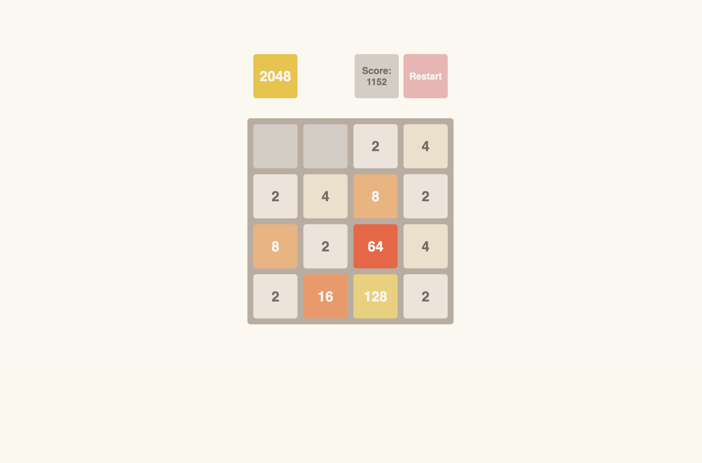
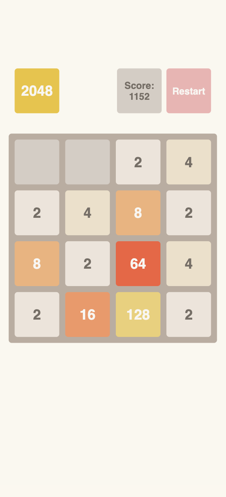

# 2048 Game

This is a clone of the popular 2048 game, designed and developed to provide an engaging user experience while enhancing gameplay mechanics and functionality.

## Table of contents

- [Overview](#overview)
  - [The challenge](#the-challenge)
  - [Getting started](#getting-started)
  - [Screenshot](#screenshot)
  - [Links](#links)
- [My process](#my-process)
  - [Built with](#built-with)
  - [Features](#features)
- [Author](#author)

## Overview

### The challenge

Users should be able to:

- Slide tiles in all directions (up, down, left, right) to combine numbers.
- Achieve a score by merging tiles of the same value.
- View the game board animations for tile movements and combinations.
- See their score update dynamically.
- Play seamlessly on both desktop and mobile devices.

### Getting Started

Prerequisites

To run this project locally, ensure you have the following installed:
-	Node.js: Version 14.x
- npm: Comes with Node.js (used for installing dependencies)
- Git: For cloning the repository

Installation
- 1. Clone the Repository
      git clone https://github.com/NKoshmak/2048-game-clone.git
- 2. Navigate to the Project Directory
      cd 2048-game-clone
- 3. Open the index.html file in your browser to play the game locally.

### Screenshots

#### Desktop View

#### Mobile View

### Links

- [Solution URL](https://github.com/NKoshmak/2048-game)
- [Live Site URL](https://nkoshmak.github.io/2048-game/)

## My process

### Built with

- Languages: JavaScript, HTML5, CSS3
- Tools: GitHub, Chrome DevTools
- Techniques: Mobile-first design, DOM manipulation, event handling

### Features

- Fully functional gameplay logic replicating the original 2048 mechanics.
- Smooth animations for tile movements and combinations.
- Dynamic score updates during gameplay.
- Responsive design for seamless play on mobile and desktop devices.
- Reset functionality to start a new game.

